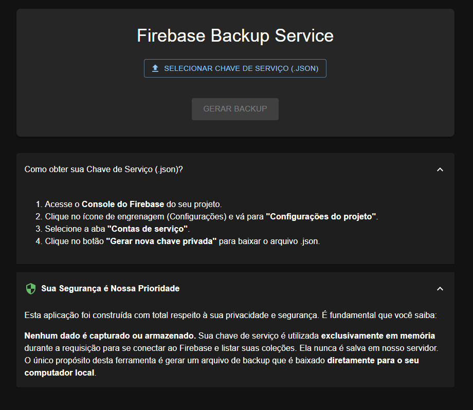

# 🔥 Firebase Backup Service

[](https://opensource.org/licenses/MIT)

Uma aplicação web full-stack que permite aos usuários gerar backups de suas bases de dados Firebase Cloud Firestore de forma segura, interativa e sob demanda.



## 📜 Descrição

Este projeto nasceu da necessidade de ter um controle maior sobre os backups do Firebase. Em vez de depender de soluções automáticas e complexas, esta ferramenta fornece uma interface gráfica simples e intuitiva onde o desenvolvedor pode, a qualquer momento, selecionar seu projeto através de uma chave de serviço, escolher as coleções desejadas e baixar um arquivo `.json` completo com os dados.

A principal prioridade da aplicação é a **segurança**: a chave de serviço do Firebase é processada exclusivamente em memória no backend e nunca é armazenada, garantindo que as credenciais permaneçam seguras.

## ✨ Funcionalidades Principais

* **Interface Gráfica Moderna:** UI limpa, responsiva e com tema escuro, construída com React e Material-UI.
* **Autenticação Segura:** Faça o upload da sua chave de serviço do Firebase. Ela é usada para uma única sessão e nunca é salva no servidor.
* **Listagem Dinâmica de Coleções:** Após o upload da chave, a aplicação se conecta ao seu projeto e lista automaticamente todas as coleções do Firestore.
* **Seleção Interativa:** Utilize checkboxes, incluindo um controle de "Selecionar Todas", para escolher exatamente quais coleções você deseja incluir no backup.
* **Backup Sob Demanda:** Gere e baixe um arquivo `.json` estruturado com seus dados com o clique de um botão.
* **Feedback Visual:** Notificações (toasts) informam o usuário sobre o sucesso, erros ou avisos durante o processo.
* **Transparência:** Seções de ajuda e segurança integradas na interface para guiar o usuário.

## 🚀 Tecnologias Utilizadas

Este projeto é dividido em duas partes principais: o frontend e o backend.

### 🎨 Frontend
* **React:** Biblioteca para construção da interface de usuário.
* **Vite:** Ferramenta de build extremamente rápida para o desenvolvimento frontend.
* **Material-UI (MUI):** Biblioteca de componentes React para um design elegante e profissional.
* **Notistack:** Para a exibição de notificações (toasts) de feedback.

### 🐍 Backend
* **Python:** Linguagem de programação principal.
* **Flask:** Micro-framework web para criar a API REST.
* **Firebase Admin SDK:** Kit de desenvolvimento oficial do Google para interação segura com os serviços do Firebase no backend.
* **Flask-CORS:** Para gerenciar as permissões de acesso entre o frontend e o backend.

## ⚙️ Instalação e Configuração

Para executar este projeto localmente, siga os passos abaixo.

### Pré-requisitos
* [Python](https://www.python.org/downloads/) (versão 3.8 ou superior)
* [Node.js](https://nodejs.org/en/) (versão 18 ou superior)
* `pip` (gerenciador de pacotes Python, geralmente vem com o Python)
* `npm` (gerenciador de pacotes Node, vem com o Node.js)

### 1. Clonar o Repositório
```bash
git clone [https://github.com/ranieryfialho/backup-db-firebase.git](https://github.com/ranieryfialho/backup-db-firebase.git)
cd seu-repositorio
```

### 2. Configurar o Backend

Primeiro, vamos preparar o "cérebro" da aplicação.

```
# Navegue para a pasta do backend
cd backend

# Crie um ambiente virtual
python -m venv venv

# Ative o ambiente virtual
# No Windows:
.\venv\Scripts\activate
# No macOS/Linux:
source venv/bin/activate

# Instale as dependências Python
pip install Flask Flask-CORS firebase-admin
```

### 3. Configurar o Frontend

Agora, vamos preparar a interface em um novo terminal.

```
# Navegue para a pasta do frontend (em um novo terminal)
cd frontend

# Instale as dependências JavaScript
npm install
```

### 4. Executar a Aplicação

Você precisará de dois terminais abertos simultaneamente.

No Terminal 1 (Backend):

```
cd backend
# Garanta que o ambiente virtual está ativo
python app.py
```

🚀 O servidor Flask estará rodando em http://127.0.0.1:5000

```
cd frontend
npm run dev
```

🎨 O servidor de desenvolvimento do React estará rodando em http://localhost:5173 (ou outra porta indicada no terminal).

Como Usar
Acesse a aplicação no seu navegador.

Clique em "Selecionar Chave de Serviço (.json)" e escolha o arquivo de credenciais que você baixou do seu projeto Firebase.

Aguarde o carregamento. As coleções do seu banco de dados aparecerão em uma lista com checkboxes.

Marque as coleções que deseja incluir no backup. Você pode usar o "Selecionar Todas" para agilizar.

Clique no botão "Gerar Backup".

A janela de download do seu navegador aparecerá. Salve o arquivo .json no seu computador.

🛡️ Segurança
A segurança das suas credenciais é a maior preocupação deste projeto. O arquivo da sua chave de serviço NUNCA é salvo no disco do servidor. Ele é enviado para um endpoint da API, lido em memória para realizar as operações necessárias (listar coleções ou gerar o backup) e descartado assim que a requisição termina.